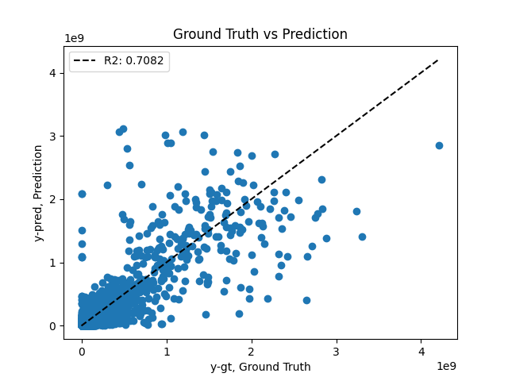

# StockMarketData
Data ref: [data](https://www.kaggle.com/datasets/jacksoncrow/stock-market-dataset)

# Note
### Airflow DAG
Host the model trained via DAG is also proving to be different because the model size is `16 GB` and I will need to pay extra to host the model, therefore 
I have hosted the model locally and shown the result in the `result.ipynb`

### Docker Container APP
To complete the docker file I need to download the final model into a cloud service and downlod it in the docker image,
the model itself is `16 GB` in size and then the scaler is in KB, but if we can upload it then write a `.py` file to download the model and scalar in the Docker file
Then we can download the model and use the docker file to create a container app to host the model.

# Getting Started
1. Install the `requirements.txt`  (based on Python 3.10)
   ```bash
        pip install -r requirements.txt
   ```
2. Run the application in debug mode
   ```bash
      uvicorn app.predictor_app:app --reload --port 8081
   ```
3. Check the OpenAPI specifications after hosting in [http://0.0.0.0/8081/docs](http://0.0.0.0/8081/docs)

# Deploying it as a container app
1. Building the docker image
    ```bash 
        docker build -t nasdaq-volume-predictor --no-cache .
    ```
2. Run the docker image 
   ```bash
      docker run -dp 8081:8081 nasdaq-volume-predictor
   ```

# Run the dag 
1. build the docker using compose
   ```bash
      docker-compose up --build
   ``` 
2. Check the [localhost:8080](https://0.0.0.0:8080)


# Test Results


# Sample Request and response
This process of how to request the API once hosted is shown in the notebook 
